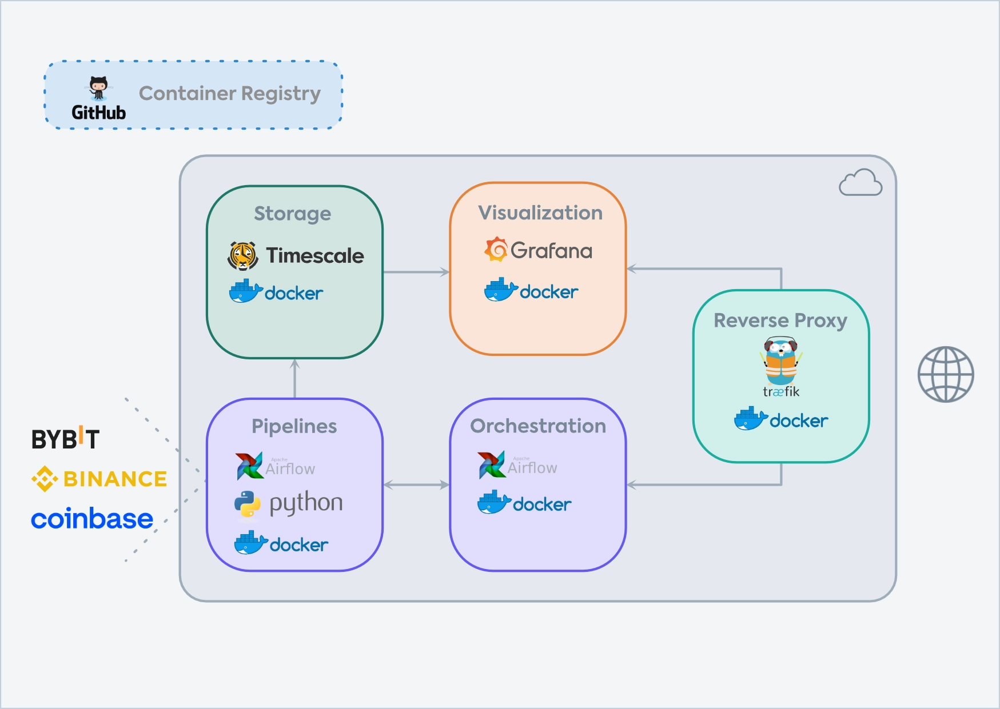

# A Practical Guide to a Simple Data Stack

This GitHub repository hosts the source code for my infrastructure
series, "A Practical Guide to a Simple Data Stack" (SDS). It expands
upon the [X articles](https://x.com/bylethquant/articles) and provides a step-by-step guide to building the data infrastructure depicted in the figure
below.

**Articles**
* [SDS #0: A Practical Guide to a Simple Data Stack](https://x.com/bylethquant/status/1826891957249212691)
* [SDS #1: Docker, Docker Compose and Setting Up Timescale](https://x.com/bylethquant/status/1828041355131859198)
* [SDS #2: Setting up Apache Airflow and Creating Pipelines](https://x.com/bylethquant/status/1830558712899228012)
* [SDS #3: Robust Crypto Data Pipelines with Apache Airflow](https://x.com/bylethquant/status/1831899712749699506)
* [SDS #4: Crypto Market Data Dashboard with Grafana](https://x.com/bylethquant/status/1833141733305295348)
* [SDS #5-1: How to Set Up the Data Stack in the Cloud](https://x.com/bylethquant/status/1835662178571190627)
* [SDS #5-2: How to Set Up the Data Stack in the Cloud](https://x.com/bylethquant/status/1836390688524767387)

## Introduction

The series is inspired by recent discussions in my crypto quant circle about leveraging modern applications like
[Grafana](https://grafana.com) for a simple data infrastructure. But what is the easiest way to gain
exposure and
utilize these tools? Today, [Docker](https://www.docker.com) stands out as an excellent tool for experimenting
with these applications. For
instance, [Grafana](https://grafana.com) can be run locally with just a few lines of code. This series aims to equip
everyone with the
knowledge necessary to deploy tools such as
[Grafana](https://grafana.com), [Timescale](https://www.timescale.com), [Apache Airflow](https://airflow.apache.org),
and [Traefik](https://traefik.io/traefik).

## Overview

Let's start with the outcome: In the substack posts, I provided a guide to building step by step the data stack as
illustrated in the figure below:

    

*Orchestration* is managed using Apache Airflow, which facilitates the implementation and management of data pipelines.
As a practical example, I will develop Extract-Transform-Load (ETL) pipelines to process 1-minute candlestick data,
including spot and future price data as well as funding rates from Binance. *Data Storage* will be handled by
Timescale. *Visualization* will be provided by Grafana, with Docker as the main hosting tool and Traefik serving as
the reverse proxy. 

Following local development, I will showcase how to deploy this infrastructure on a cloud service
provider. A domain will be registered through [Porkbun](https://porkbun.com/), with DNS records set up to enable access
to Docker containers via
subdomains such as airflow.mydomain.com and grafana.mydomain.com.

Additionally, while Binance data ingestion pipelines serve as the primary example, the infrastructure is designed with
flexibility in mind. It can accommodate pipelines for processing log files or any other data sources.

In what follows, I aim to keep everything straightforward so that anyone can adopt elements of this data stack
for their own data infrastructure.

## Who Should Read This Series

This series is for those who are looking to take their first steps in developing their own data infrastructure. It is for individuals who want to:
* Host these tools locally via Docker to experiment with them. 
* Deploy them to the cloud.

## Tools

* Docker Desktop 4.27.2
* Python 3.11.5
* Airflow 2.8.1
* Grafana 10.0.2
* Timescale pg15
* Traefik 3.0
